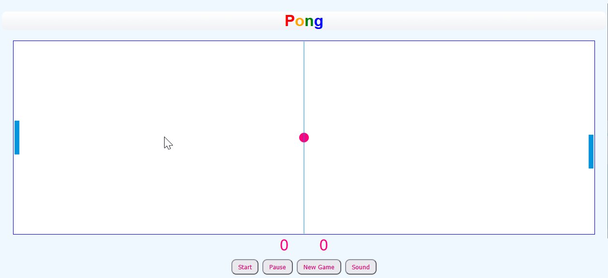

# 🏓 Pong

Un jeu de Pong classique développé en JavaScript vanilla avec l'API Canvas.



## 🎮 Démo

Vous pouvez jouer directement en ouvrant `index.html` dans votre navigateur, ou via GitHub Pages :

👉 [Jouer en ligne](https://oliver791.github.io/pong/)

> Remplacez le lien ci-dessus par votre URL GitHub Pages une fois activé.

## 🕹️ Contrôles

| Action | Contrôle |
|---|---|
| Déplacer la raquette | **Souris** (haut/bas) |
| Déplacer la raquette | **Flèche ↑** / **Flèche ↓** |
| Lancer la partie | Bouton **Start** |
| Mettre en pause | Bouton **Pause** |
| Nouvelle partie | Bouton **New Game** |
| Activer/couper le son | Bouton **Sound** |

## 📐 Règles

- Le premier joueur (vous ou l'ordinateur) à atteindre **10 points** remporte la partie.
- La balle accélère légèrement à chaque rebond sur votre raquette.
- L'angle de rebond dépend de l'endroit où la balle touche la raquette.

## 🗂️ Structure du projet

pong/
├── index.html # Page principale
├── pong.js # Logique du jeu
├── son/ # Fichiers audio
│ ├── pingMur.ogg
│ ├── pingRaquette.ogg
│ ├── Whoosh 10.ogg
│ ├── Applaudissements_Win.ogg
│ └── Aaah.mp3
├── screenshot.png # Capture d'écran
└── README.md


## 🚀 Installation

Aucune dépendance nécessaire. Il suffit de cloner le dépôt et d'ouvrir le fichier HTML :

```bash
git clone https://github.com/oliver791/pong.git
cd pong
open index.html


🛠️ Technologies

    HTML5 Canvas
    CSS3
    JavaScript (ES6)

📝 Licence

Ce projet est libre d'utilisation. Fait avec ❤️ par Oliver791.
